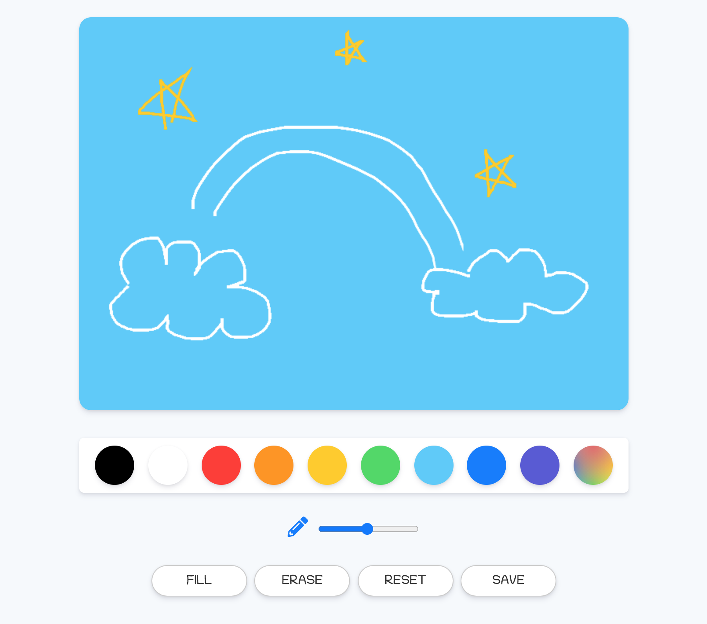

# PaintJS

PaintJs is a Paint Board made with VanillaJS.

 

## Features
- Pick colors.
- Change the pen size.
- Paint the board.
- Fill the board.
- Erase the paint.
- Reset the board.
- Save the paint as an image.

 

## Overview 
